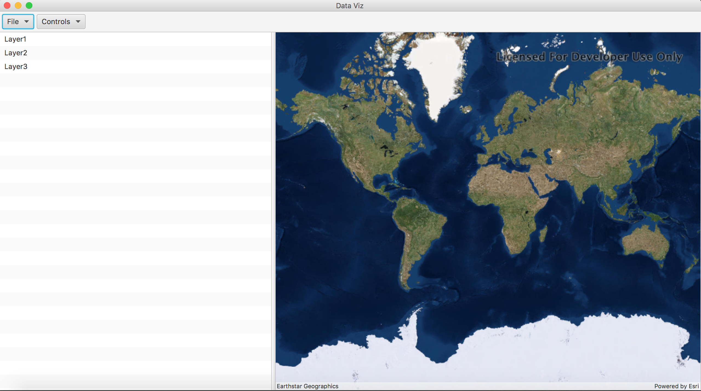

# earthDataVisualizationTool
A visualization tool to project data from Earthdata on a map

Instructions:

Pre-requisites: 

1. Get the HDF Java installation and also the ArcGIS installation file from this link:
https://drive.google.com/open?id=0BzOo3S_zMQSDOWlERHR2U1pJZjA

2. Put your HDF Java Libraries in a location of preference.

3. Install ArcGIS SDK provided. If you need instructions you can follow this guide: https://developers.arcgis.com/java/10-2/guide/install-the-sdk.htm

Setting up project:

1. Git clone the project using: git clone https://github.com/somtirtha/earthDataVisualizationTool.git

2. Open the project in Eclipse and right click on the project directory.
Go to Run As> Maven Install and let Maven do the job of installing all the dependencies for you.

3. Once installed go to Maven> Update project

4. Add the following to the run configurations in Eclipse: -Djava.library.path=(PATH TO HDF JAVA LIBRARIES)/CMake-hdfjava-3.3.2/HDF_Group/HDFJAVA/3.3.2/lib

5. Run the project by gong to Run As> Run as Java application or by clicking on the run button in the toolbar.

